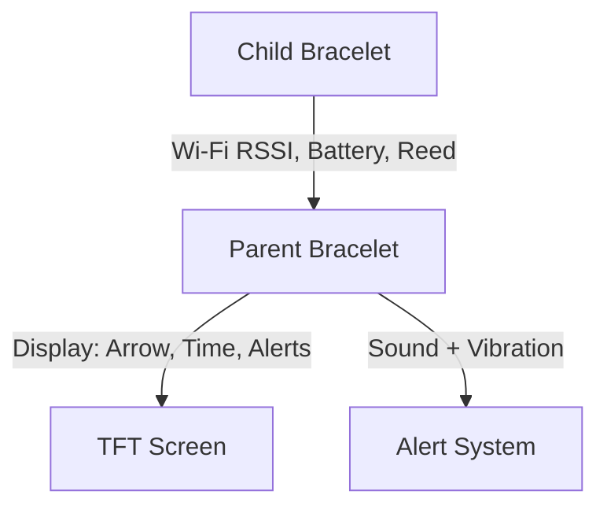

# SafeLink – ESP32-Based Proximity Bracelet System

**SafeLink** is a smart wearable system designed to enhance the safety of children and elderly individuals. It establishes a wireless proximity link between two ESP32-based bracelets—one worn by a parent or caregiver, and the other by a child or dependent. The system provides real-time distance estimation, directional guidance, and alert feedback to help prevent separation in crowded or hazardous environments.

## 💡 Key Features

- 📡 **Wi-Fi Communication:** ESP32 in dual mode — acts as AP for the child and connects as STA to parent’s phone.
- 🧭 **Compass-Based Direction:** The parent bracelet uses the QMC5883L sensor to display the direction to the child.
- 📏 **Distance Estimation:** RSSI values are used to approximate how far the child is.
- ⏰ **NTP Time Sync:** Parent bracelet synchronizes real-time clock from internet via NTP.
- 🔋 **Battery Monitoring:** Battery percentages shown for both devices.
- ⚠️ **Alerts:** Sound, vibration, and on-screen warnings for:
  - Distance thresholds
  - Tampering (reed switch)
  - Disconnection or timeout
 
## 🧰 Libraries Used

- WiFi.h
- WiFiUdp.h
- NTPClient.h
- time.h
- Wire.h
- MechaQMC5883.h
- TFT_eSPI.h

🧰 Hardware Components
👨‍👧 Parent Bracelet
| **Component**              | **Description**                              |
| -------------------------- | -------------------------------------------- |
| **D1 Mini ESP32**          | Microcontroller with built-in WiFi & BLE     |
| **GC9A01 TFT Display**     | 1.28" round LCD for direction and alerts     |
| **QMC5883L Compass**       | Digital magnetometer for heading calculation |
| **Piezo Buzzer**           | Audio alert for out-of-range warnings        |
| **Vibration Motor**        | Haptic feedback for silent alerts            |
| **TP4056 Charger Module**  | Li-Po battery charging and protection        |
| **Li-Po Battery**          | Rechargeable power supply                    |
| **Reed Switch (optional)** | Manual alerts or case-open detection         |

🧒 Child Bracelet
| **Component**             | **Description**                           |
| ------------------------- | ----------------------------------------- |
| **D1 Mini ESP32**         | Microcontroller with built-in WiFi & BLE  |
| **Vibration Motor**       | Haptic feedback for alert reception       |
| **Reed Switch**           | Tamper detection for unauthorized removal |
| **TP4056 Charger Module** | Li-Po battery charging and protection     |
| **Li-Po Battery**         | Rechargeable power supply                 |

## 🧪 How It Works

## 🚀 Getting Started

### Prerequisites

- Arduino IDE with ESP32 board support
- Required libraries:  
  - `MechaQMC5883`  
  - `TFT_eSPI` (configured for GC9A01)  
  - `WiFi` / `esp_now`

### Uploading the Code

1. Open `Parent_Code.ino` or `Child_Code.ino` in Arduino IDE.
2. Select **ESP32 Dev Module** as the board.
3. Connect your ESP32 and upload the code.

## 🛠️ How to Test

1. Power on both bracelets.
2. Ensure they are within range and paired (via ESP-NOW).
3. Move child device away to observe direction changes and alerts.
4. Test tamper detection by removing or triggering the reed switch.

## 📷 Screenshots / Media

  
  

## 📄 Project Documents

- [Child Bracelet Schematic](Child-Bracelet-Schematic.pdf)
- [Parent Bracelet Schematic](Parent-Bracelet-Schematic.pdf)

## 📁 Project Structure

| File | Description |
|------|-------------|
| `Parent_Code.ino` | Arduino code for the parent bracelet |
| `Child_Code.ino` | Arduino code for the child bracelet |
| `Parent-Bracelet-Schematic.pdf` | Circuit schematic for parent device |
| `Child-Bracelet-Schematic.pdf` | Circuit schematic for child device |
| `README.md` | This file |
